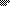
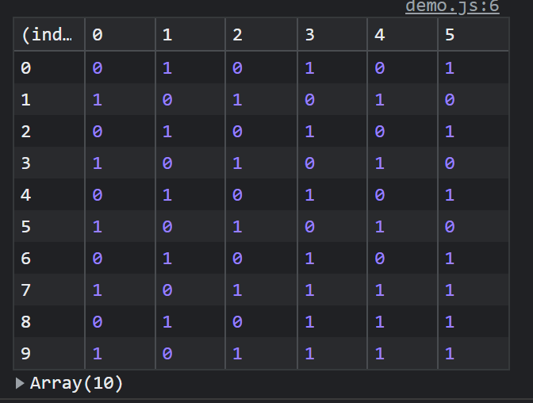

# Vectorize
Convert an image to use as a map

the `Vectorize` constructor takes in an image name like so:

```js
let vec = new Vectorize("my_map.png")
```
Outputs array like [output.png](demo/output.png)

`Vectorize` stores an image in an image instance, draws it to a hidden canvas, gets the rgba values of each pixel, determines black or white, then adds that to an array before converting it to a 2d array to return as the final result.

## Under the hood 
1. create image instance from image name provided
2. draw to canvas
3. get pixel data from canvas
4. sort into black or white array
5. collapse pixels into array of 1 (white) or 0 (black)
6. build 2D array
7. return

## Draw
The optional draw function takes a number used for scaling. if no argument is provided, 1 will be used.
```js
vec.draw(1)

// is equal to
vec.draw()
s
// draw at 2x
vec.draw(2)
```

## Input


## Output
